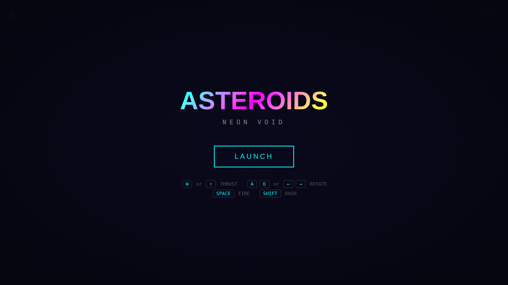
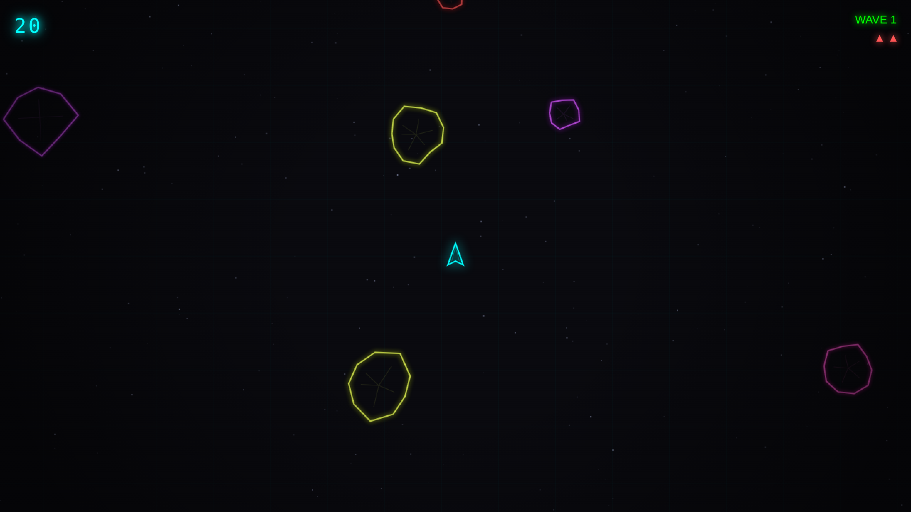
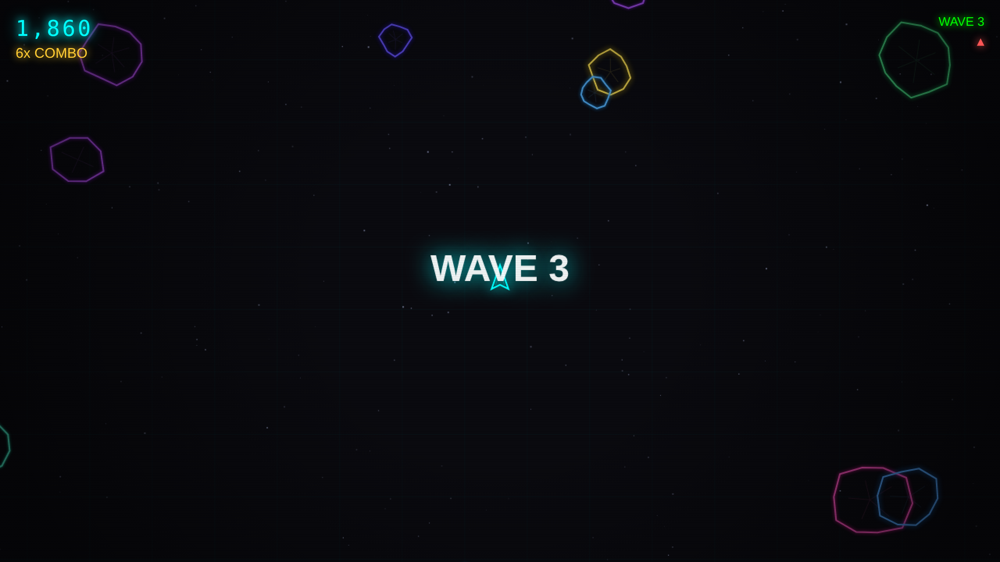
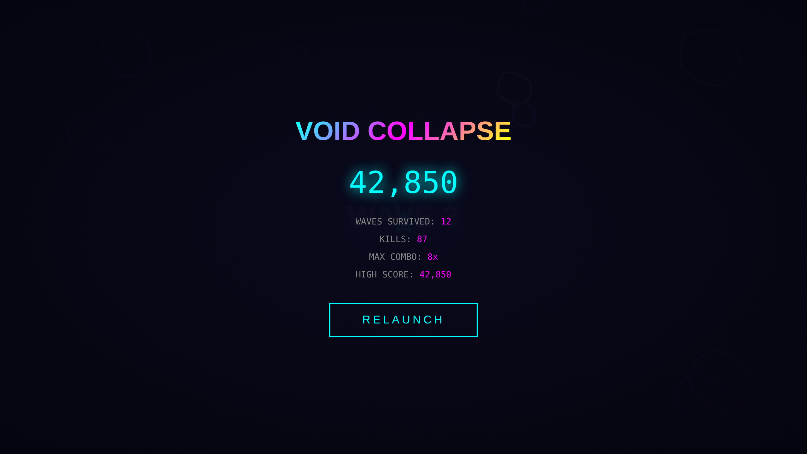

# ASTEROIDS: NEON VOID

A modern reimagining of the 1979 Atari classic. Same core gameplay, but wrapped in neon glow, combo scoring, power-ups, boss fights, and enough screen shake to feel every hit.

## Play

Open `index.html` in any modern browser. No build step, no dependencies, no server required.

## Screenshots

### Gameplay
Navigate through waves of neon asteroids. Shoot them to break them apart, dodge the fragments, and rack up combos.

### Wave Progression
Each wave brings more asteroids at higher speeds. Clear them all to advance. Every 5th wave summons a boss.

### Game Over
Track your kills, max combo, waves survived, and compete against your own high score (saved locally).

## Controls

| Key | Action |
|---|---|
| `W` / `Arrow Up` | Thrust |
| `A` / `Arrow Left` | Rotate left |
| `D` / `Arrow Right` | Rotate right |
| `Space` | Fire |
| `Shift` | Dash (dodge with i-frames) |

Touch controls are available on mobile.

## Features

### Classic
- Vector-style ship and asteroids with screen wrapping
- Asteroids split into smaller pieces when destroyed
- Escalating wave difficulty
- Lives system with respawn invulnerability

### Modern
- **Neon glow aesthetic** with colored outlines, bloom, and CRT scanlines
- **Combo system** -- chain kills within a short window for up to 10x score multiplier
- **Dash** -- burst of speed with invincibility frames on a cooldown
- **Power-ups** drop from destroyed asteroids:
  - **Triple Shot** -- fires 3 bullets in a spread
  - **Shield** -- absorbs one hit
  - **Rapid Fire** -- doubles fire rate
  - **Nuke** -- destroys everything on screen
- **Boss fights** every 5 waves with movement patterns and aimed bullet attacks
- **Screen shake** and particle explosions on every hit
- **Floating damage numbers** with combo multiplier display
- **Procedural audio** -- all sound effects synthesized via Web Audio API (no audio files)
- **Starfield** background with twinkling stars and a subtle moving grid
- **High score** persistence via `localStorage`

## Tech

Two files. No frameworks.

- `index.html` -- markup, styling, and UI overlays
- `game.js` -- entire game engine (~900 lines)

Rendering uses Canvas 2D with `shadowBlur` for the glow effects. Audio is generated at runtime with the Web Audio API using oscillators and noise buffers.

## License

See [LICENSE](LICENSE).
